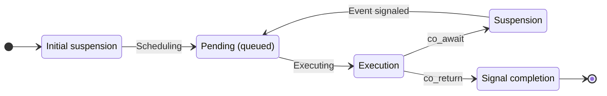

# Ruken Executive System (ES)

The executive system is designed to allow developers to quickly and easily manage the flow of execution of their code among the various processors of the machine in a asynchronous manner. 

## Table of Content - Terminology

 - [**Processing Unit**](#processing-unit): Things that executes tasks.
 - [**Processing Queue**](#processing-queue): A primitive allowing the categorization and prioritization of tasks by the owning processing unit.
 - [**Task**](#tasks): A single unit of work that may be executed asynchronously.
 - [**Asynchronous Event**](#asynchronous-event): An event that can be waited on, and may be dependent on other events.

---

## Processing Unit

Processing units are things that executes tasks.

They do not necessarily represent a physical processor on the machine, but they rather act as an abstraction. For example they can be used to implement different rendering backend for the GPU, or even a way to interact with a cloud-based machine. By default Ruken already implements a CPU (Central Processing Unit) and a GPU (Graphics Processing Unit).

In order for the executive system to properly dispatch tasks, processing units contains 2 important properties:

 - **The execution policy** than can be of 2 types:
   - **Immediate**: The processing unit will execute instructions as soon as possible.
   - **Deferred**: Instructions sent to this processing unit are recorded and will need to be manually submitted in order to start execution. This is similar to the way command buffers in Vulkan works.

 - **The instruction type**:
   - **Direct**: The content of the task run by the executing system are the actual instructions needed to be ran to bring the task to completion.
   - **Indirect**: The content of the tasks run by the executive system are not the actual instruction needed to run the task to completion, instead they are an indirection needed to record, or send a command to the actual physical processing unit so that the designated task can start running. Indirect instructions are always ran in place.

Processing units does not execute tasks directly and instead uses [**ProcessingQueue**](#processing-queue)s to do so, more info in the next section.

## Processing Queue

A primitive allowing the categorization and prioritization of tasks by the owning processing unit.

Due to the asynchronous nature of the executive system, [**processing units**](#processing-unit) don't just execute tasks right away, and use instead a level of indirection called a processing queue. These queues allows the processing unit to categorize and prioritize some tasks over others, to minimize latency as well as optimize throughout as much as possible.
Some processing units even allow for the creation and configuration of custom queues to add more granularity to your application if needed (ie. for path-finding, or procedural generation tasks).

## Task

A single unit of work that may be executed asynchronously.

Here is a diagram of a task life cycle:  
:warning: This does not represent the actual execution of the task *(because of the [**Processing Unit**](#processing-unit)'s execution policy and instruction type)*, but rather the way it is handled semantically by the executive system.

