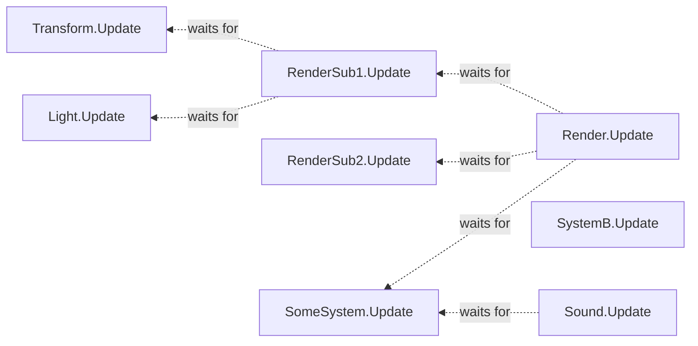
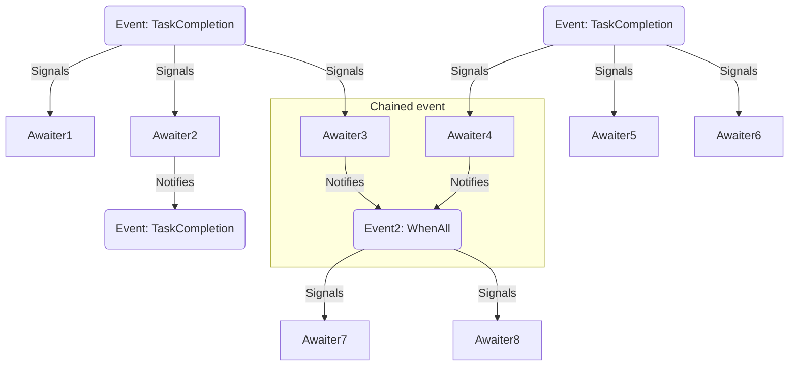
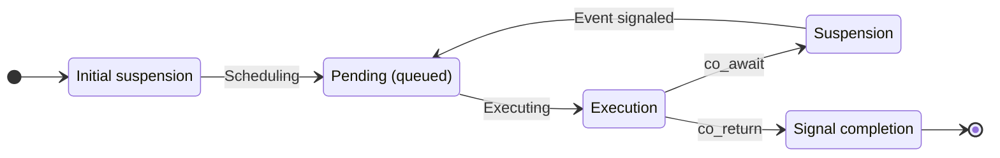
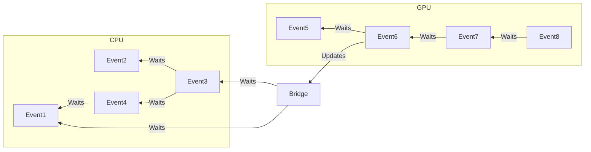
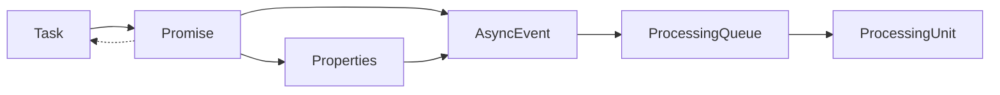

# Ruken Executive System (ES)

The executive system is designed to allow developers to quickly and easily manage the flow of execution of their code among the various processors of the machine in a asynchronous manner. 

## Terminology
- [**Task**](#tasks): A single unit of work that may be executed concurrently.
- [**Event**](#events): An event that can be waited on, and may be dependent on other events.
- [**Queue**](#queues): A primitive allowing the categorization and prioritization of tasks by the owning executor.
- **Executor**: An executor is responsible for the execution of tasks. This is usually a CPU or a GPU but could very well be a distant server.  
- **Awaiter**: Responsible for waiting for an event to be completed (aka. signaled).
A single awaiter can only be used to wait for a single event at a time and cannot be reused ([more here](#events)).

By default, creating a task implicitly creates a completion event.
This implicit event can be waited on, and wait for other events, effectively creating a dependency graph that will be resolved concurrently.  

> The following example shows one of these dependency graphs, resolved from left to right.
> This particular case can use a maximum of five threads.



## Events

These can be thought of as synchronization points and must be used thoughtfully to maximize the concurrency of your graph.


- **TaskCompletion**: Signaled when the task is completed.
- **WhenAll**: Signaled when all passed events have been signaled.
- **WhenAny**: Signaled when any of the passed events have been signaled.



## Tasks

Tasks are coroutines that cannot yield any value

> Here is a diagram of a task life cycle:  
> A task is executed lazily, and thus needs to be scheduled for execution in the first place via a `WorkingQueue`.  
> Upon execution, the content of the task is ran as usual until an event is awaited.
> When the awaited event is finally signaled, the task is rescheduled back for execution on the original `WorkingQueue`.  
> Upon completion, the underlying event is signaled allowing other dependent tasks to be re-scheduled.



  
*Do note that even though a task can be rescheduled from one queue to another, this will come at a significant price due to some potential underlying memory reordering: [more on queues](#queues)*

## Queues

`WorkingQueue`s allow for a controlled distribution of tasks across the thread pool.
This is useful for differentiating between different kind of loads and allocating resources accordingly.  
Here is a list of the default queues in Ruken:
- **ECS queue**: High priority queue used for ECS updates.  
Most of the threads allocated to this queue are reactive, jobs will be executed as soon as possible.  

- **IO queue**: Low priority queue used for IO operations.  
Most of the threads allocated to this queue are lazy, meaning that a scheduled task might take up to some milliseconds to begin its execution, saving on resources.

More queues can be added and configured on demand based on the needs of your application (path-finding, editor baking tasks, etc.).

## Workers

Workers can be thought of as "smart" threads. By default the thread pool creates one worker per logical core. These workers can be configured at runtime and have their own individual routine.

Workers have two modes:
- **Reactive**: A reactive worker will continuously and actively look for tasks even if none are currently available. This greatly lowers the latency (ns range) at the cost of resources that may have been better spent somewhere else. Great for performance critical repetitive tasks.
- **Relaxed**: A relaxed worker will automatically fallback to distracted status if no tasks are left available in any of its queues. This is useful to save on resources at the cost of a higher latency (ms range). Great for occasional non critical tasks. 

These modes automatically switch the worker's status when appropriate to one of the following states:
- **Distracted**: The worker is paused and its resources are dispatched among other tasks in the system, lowering the overall CPU usage. Handling a new job will require the worker to be notified.
- **Concerted**: The worker is currently active or looking for tasks. New tasks will be handled with low latencies but the worker will remain active even if there is nothing to be done.

---
> As a result a typical frame could look like this with a small game:  
> Here the ECS queue is assigned to workers 1 to 6 and the IO queue is assigned to the workers 6 and 7.

```mermaid
gantt
	title Typical execution of a frame
	axisFormat %L ms
	dateFormat x

	section Main Thread
	Bookkeeping            	    :0, 1
	Transform.Update            :1, 5
	section Worker1
	Render.Present			    :14, 16
	section Worker2
	Sound.Update           		:5, 7
	SomeSystem.Update           :7, 11
	section Worker3
	Inputs.Polling           	:milestone, 0, 1
	Physics.Update           	:5, 9
	section Worker4
	SomeSystem.Update           :1, 4
	section Worker5
	Render.Update           	:9, 14
	section Worker6
	Network.Upload           	:10, 15
	[...] Mesh.Load           	:0, 10
	section Worker7
	Texture.Load [...]          :0, 16
```



**Note:** The main thread being in charge of the bookkeeping may help whatever queue it is currently waiting completion of *(ECS queue in this example)*.

# Scheduling & Queue virtualization


Queue types:
  - **ECS**: Entity component system queue.
  - **IO**: IO queue, (networking, resource management).
  - **Pathfinding**
  - **Lightmapper**
  - **Procedural generation**
  - **Editor.Repaint**

Each queue has multiple parameters:
  - **Priority**: The priority of the queue.
  - **Haltable**: Whether or not the queue can be halted in profit of other queues.
  - **Capacity**: The maximum number of tasks that can be scheduled in the queue. Exceeding this limit will simply wait for free space.
  - **Concurrency**: The maximum amount of workers that a queue can utilize at a given point in time.
  - **Maximum concurrency**: The maximum amount of workers that a queue can utilize at all times.

---

```cpp
Task<GPUQueue> BakeReflectionProbe(ReflectionProbe& probe)
{
	Array<RenderTarget, 6> textures;

	access = co_await WaitReadWriteAccess(textures); // < Waits for an access to the resource
	
	co_await Task<GPUQueue>::WhenAll(
		Render(textures[0]),
		Render(textures[1]),
		Render(textures[2]),
		Render(textures[3]),
		Render(textures[4]),
		Render(textures[5])
	);

	ExecutiveSystem::Submit<GPUQueue>();
}
```



## Class dependencies


