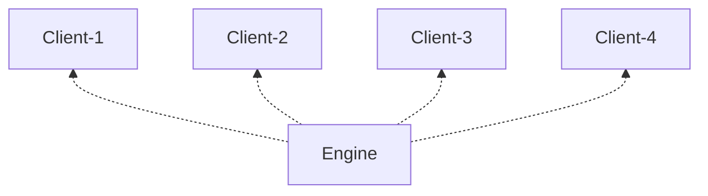

# Ruken
 
Ruken is fully asynchronous, data oriented and Vulkan based game engine. Link to the latest release [here](https://github.com/Renondedju/Ruken/releases).  
No generative AI was used and will ever be used for the development of this project. This is a toy project meant for experimentation.

Here is the table of content :
<!-- TOC -->
* [Ruken](#ruken)
  * [Philosophy](#philosophy)
  * [Main Features](#main-features)
    * [Job System](#job-system)
      * [1. Tasks](#1-tasks)
      * [2. Awaitables](#2-awaitables)
  * [To Do](#to-do)
<!-- TOC -->

## Philosophy

Ruken aims to be used like a configurable, consumable CMake framework or library instead of being a kind of
environment you have to build into and that isolates your code from the outside world.

For this matter, the implementation can currently be compiled with msvc and gcc, is compatible with Windows and Linux and is tested on ARMv7 and x64. 

The engine is separated into a list of 'modules' or libraries basically that can be mixed and matched 
at will to build any kind of process intensive applications, not just games.  
Modules implement various 'services' which are basic building block of an application. 
They are stored in a tree-like structure that allows cooperation and sharing of behavior/resources among leafs.  

For example, when developing a multiplayer game you might want to be able to run multiple clients simultaneously to test your code.
Here the engine node or 'ServiceProvider' would implement the job system, file system, resource manager and each client nodes would 
have their own window manager, world state etc...  



This is notably why the concept of 'frames' is not clearly defined by the engine and can be specific to each executable.

## Main Features

---
### Job System

A lot of things in Ruken are based off of the (asynchronous) job system, that is a combination of 2 things:
 - Tasks (or coroutines)
 - Awaitables

Let's start with tasks...

#### 1. Tasks

Tasks are scheduled to queues. Queues are used to dispatch tasks among worker threads with some kind of priority.
This is meant to be configurable, notably using the 'WorkerRequestTree' class, although I am not completely satisfied with the current implementation.

Tasks are coroutines, that can be executed synchronously or asynchronously based on your needs:

```c++
struct MainQueue : QueueHandle<MainQueue, 2024> {};

AsyncTask<MainQueue> AsyncJob()
{
    // ... Do some stuff 

    // When using the keyword 'co_await', execution of the task is suspended
    // and the worker thread will try to work on some other task in the meantime.
    // That also could mean going to sleep if there is nothing else to do.
    
    // When the awaited event is done, all of the awaiting
    // tasks are scheduled back to their original queue, ready to be
    // picked up by the first avaliable worker.
    co_await OtherTask();
   

    // ... More work

    co_return;
}
```
   
Tasks can also return results or propagate exceptions when awaited.

```c++
SyncTask<int> ComputeSomething(int in_value)
{
    co_return in_value + 1;
}

AsyncTask<MainQueue> AsyncMain()
{
    SyncTask<int> task {ComputeSomething(10)};

    // Exceptions are propagated when awaiting
    int result {co_await task};
}

```

Ruken uses [Tracy](https://github.com/wolfpld/tracy), a realtime profiler to make profiling and debugging easier.
Task activity is also automatically reported without having to manually instrument everything.

#### 2. Awaitables

Tasks are in fact a special case of awaitables but there are many others:
 - Mutex
 - SharedMutex
 - ManualResetEvent
 - AutomaticResetEvent
 - CountDownLatch
 - and probably more to come ...
    
Each of these structures implement a member 'operator co_await()' that returns an 'Awaiter'.
Put simply, an awaiter is a structure in charge of answering the following question: "How to wait ?".

Waiting can be then done in 2 ways:

 - Synchronously (or blocking): meaning that the wait will be 'inlined' into the caller.
 - Asynchronously: execution of the caller is not paused and end of the wait is notified via a configurable callback. (see SignalReceiver)

---

## To Do

There are a lot of things I plan on doing with this engine, of which I keep track of using the list bellow, in no particular order:

- Modularization of the code *(instead of using headers)*
- Hot Reloading of modules
- Automatic hot reloading of resources with a file watchdog
- Automatic serialization *(waiting for c++26's compile time reflexion)*
- Unit Testing
- Visual Editor *(c++26)*
- Command parser


